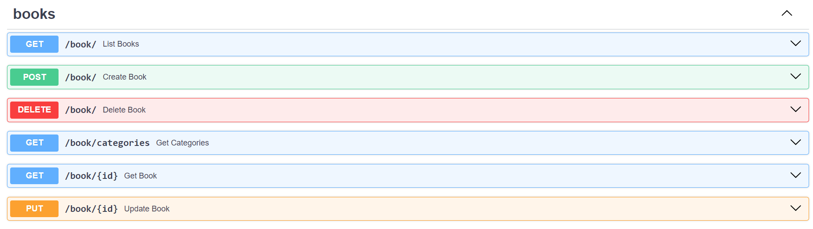
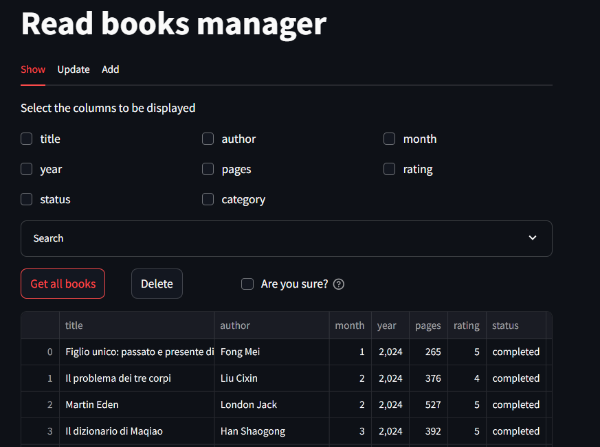
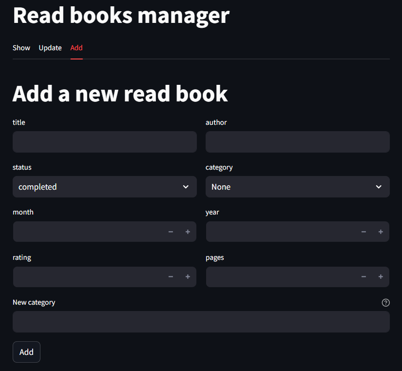

# Books organizer
A simple project to visualize and manage a collection of read books. The project is born with the aim to learn more about [MongoDB](https://www.mongodb.com/) and RESTapi.
It is composed by a simple ETL script, in which the data are extracted, combined and pushed to the database, by an API written in [FastAPI](https://fastapi.tiangolo.com/) that exposes several routes, and by a simple visualizer written using [streamlit](https://streamlit.io/) that allows to interact with the API.

## API entry points

## Visualizer
The streamlit visualizer allows to interact with the database, visualizing, adding or updating the books.

### Visualize and delete

### Add new books

